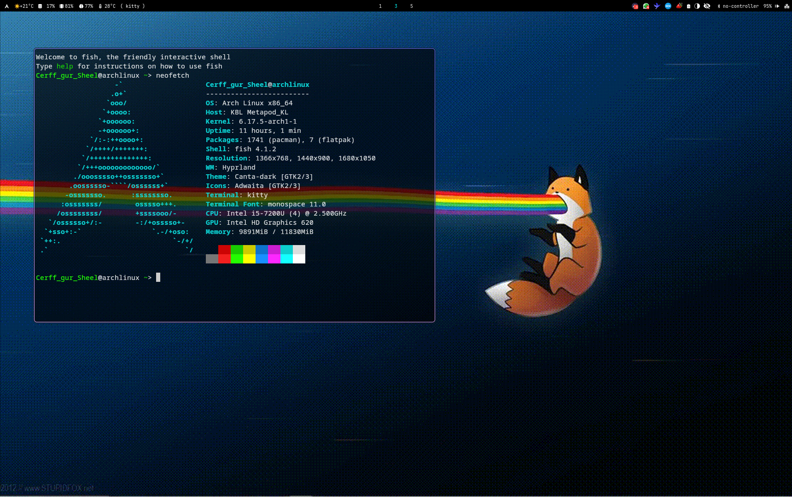

# 🖥️ Rice Config - Press Archconf Edition

Meu setup pessoal de rice para Arch Linux, focado em estética, produtividade e modularidade. Cada componente do sistema é configurado com atenção aos detalhes e separado em pastas específicas para facilitar manutenção e personalização.



---
## Principais Recursos

```bash
.
├── btop/           # Monitoramento de sistema com tema customizado
├── fish/           # Shell interativo com configurações pessoais
├── home/           # Arquivos de usuário (placeholder)
├── hypr/           # Configuração completa do Hyprland
│   ├── hyprland.conf
│   ├── hyprlock.conf
│   ├── hyprpaper.conf
│   └── land/       # Configuração modular estilo Archconf
├── kitty/          # Terminal com tema e atalhos
├── setup.sh        # Script de instalação/configuração
├── theming/        # Temas GTK, QT, NWG-look
├── wallpapers/     # Imagens e GIFs usados no setup
├── waybar/         # Barra de status com scripts personalizados
└── wofi/           # Menus e estilo do launcher
```

---
## Hyprland

Minha configuração personalizada do Hyprland foi feita para ser modular, limpa e funcional, por meio da separação clara de responsabilidades e foco em produtividade, estética e ergonomia.

### 📁 Estrutura de Diretórios

Toda a configuração está organizada dentro de `~/.config/hypr/`, com os seguintes arquivos:

| Arquivo               | Função                                                                 |
|-----------------------|------------------------------------------------------------------------|
| `hyprland.conf`       | Arquivo principal que referencia os módulos                           |
| `vars.conf`           | Variáveis globais (ex: `$MAIN_MOD`, `$TERM`, etc.)                    |
| `envs.conf`           | Variáveis de ambiente e execuções iniciais                            |
| `inputs.conf`         | Configurações de teclado, mouse e touchpad                            |
| `binds.conf`          | Todos os atalhos de teclado e mouse, incluindo o Lazy Mode            |
| `monitors.conf`       | Layout de monitores e resolução                                       |
| `lookandfeel.conf`    | Temas, bordas, cores e aparência geral                                |
| `animations.conf`     | Animações e transições                                                |
| `rules.conf`          | Regras específicas para janelas (ex: opacidade, floating, etc.)       |
| `autostart.conf`      | Aplicativos e serviços iniciados com o Hyprland                      |

---

### 🧠 Lazy Mode

Um dos destaques dessa configuração é o **Lazy Mode** — um modo de navegação que usa exclusivamente o teclado numérico, ideal para quem quer controlar o WM com uma mão só.

#### Funcionalidades:

- Entrar no modo com `KP_Decimal`
- Alternar entre submodos:
  - `KP_Enter` → mover foco
  - `KP_Add` → mover janela
  - `KP_Multiply` → redimensionar janela
  - `KP_Divide` → trocar de workspace
  - `KP_Subtract` → mover janela para workspace

Tudo isso sem precisar usar o `$MAIN_MOD`!

---

### 🚀 Recursos Adicionais

- Suporte a 10 workspaces + workspace especial (`magic`)
- Controles de mídia via XF86 e teclado genérico
- Atalhos para captura de tela, color picker, clipboard, notificações
- Controles de energia (desligar, reiniciar, hibernar, sair)
- Modularidade total para fácil manutenção e expansão

---

## 🛠️ Instalação

Baixe o setup.sh e execute

```bash 
git clone https://github.com/cerff-gur-sheel/rice.git ~/.config/rice
cd ~/.config/rice/btop/ 
./setup.sh
```

